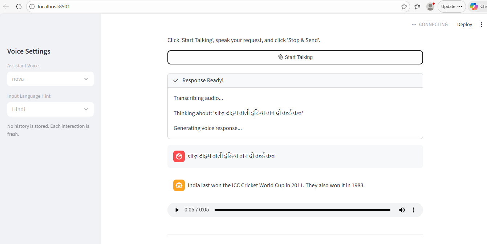

# Vaani AI - GenAI Voice Assistant



Vaani AI is a real-time, stateless voice assistant that converts spoken input into a short, high-quality AI response and plays it back as synthesized speech.

## What I Implemented as a GenAI Engineer

1. End-to-end voice AI pipeline
- Mic capture in browser UI
- Speech-to-text transcription
- LLM response generation
- Text-to-speech voice output

2. Production-focused prompt and response control
- Structured system prompt for concise, professional responses
- English-only answer constraint
- Low-latency, short output behavior for voice UX

3. Multilingual input robustness
- Input language hint support: Auto-detect, Hindi, English
- Optional forced language code for more accurate transcription

4. Stateless conversation design
- One-shot interaction model with no conversation memory
- Better privacy and predictable behavior per request

5. Audio quality and reliability safeguards
- Short/unclear audio rejection handling
- Temporary file lifecycle management and cleanup
- User-facing status updates for each pipeline stage

6. Deployability and developer experience
- Dockerfile + docker-compose setup
- Environment-variable based configuration
- Minimal dependency setup for quick local start

## Tech Stack Used

### GenAI APIs and Models
- OpenAI Whisper (`whisper-1`) for speech-to-text
- OpenAI GPT model (`gpt-4o-mini` via LangChain) for response generation
- OpenAI TTS (`tts-1`) for speech synthesis

### Frameworks and Libraries
- Streamlit (web app UI)
- streamlit-mic-recorder (microphone capture)
- LangChain + langchain-openai + langchain-core (LLM orchestration)
- OpenAI Python SDK (model/API access)
- python-dotenv (environment variable loading)

### Runtime and Deployment
- Python 3.11+
- Docker and Docker Compose

## Project Structure

```text
.
|- app.py
|- requirements.txt
|- Dockerfile
|- docker-compose.yml
`- docs/
```

## Quick Start (Local)

1. Clone and enter the project directory.

```bash
git clone <your-repo-url>
cd Vaani-AI
```

2. Create and activate a virtual environment.

```bash
python -m venv .venv
# Windows PowerShell
.venv\Scripts\Activate.ps1
# macOS/Linux
source .venv/bin/activate
```

3. Install dependencies.

```bash
pip install -r requirements.txt
```

4. Create a `.env` file in the project root.

```env
OPENAI_API_KEY=your_openai_api_key
```

5. Run the app.

```bash
streamlit run app.py
```

6. Open http://localhost:8501

## Docker

### Option 1: Docker CLI

```bash
docker build -t vaani-ai .
docker run --rm -p 8501:8501 --env-file .env vaani-ai
```

### Option 2: Docker Compose

```bash
docker compose up --build
```

## Environment Variable

- `OPENAI_API_KEY` (required): Used for STT, LLM, and TTS API calls.

## Current Architecture Flow

1. Record voice using push-to-talk.
2. Validate and persist temporary audio.
3. Transcribe speech to text with Whisper.
4. Generate concise answer via LLM.
5. Synthesize answer to speech with TTS.
6. Return both text response and autoplay audio.
